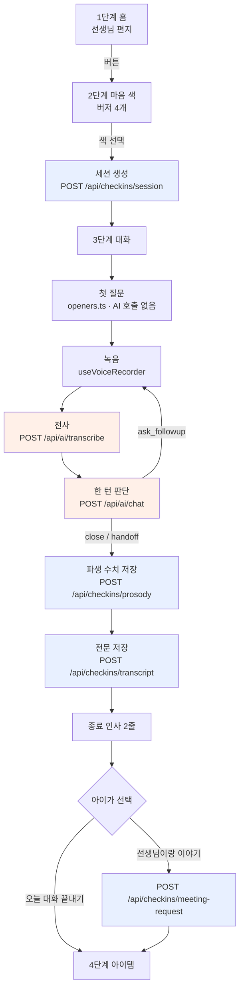
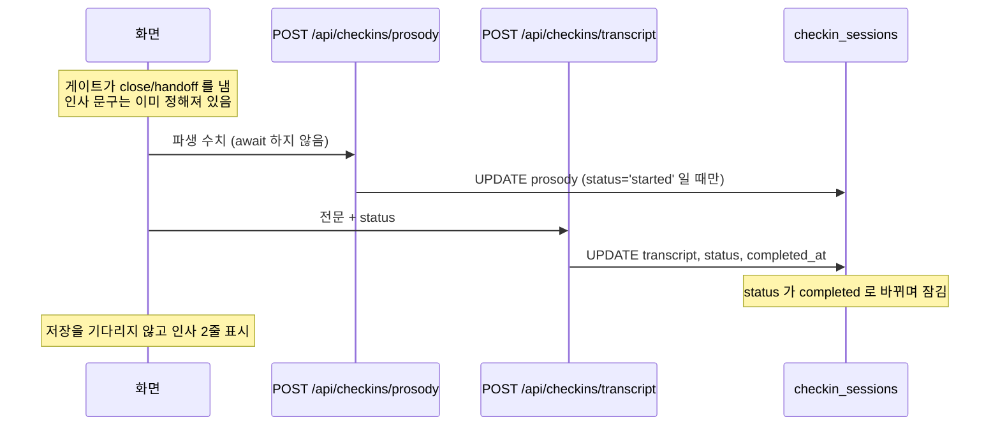
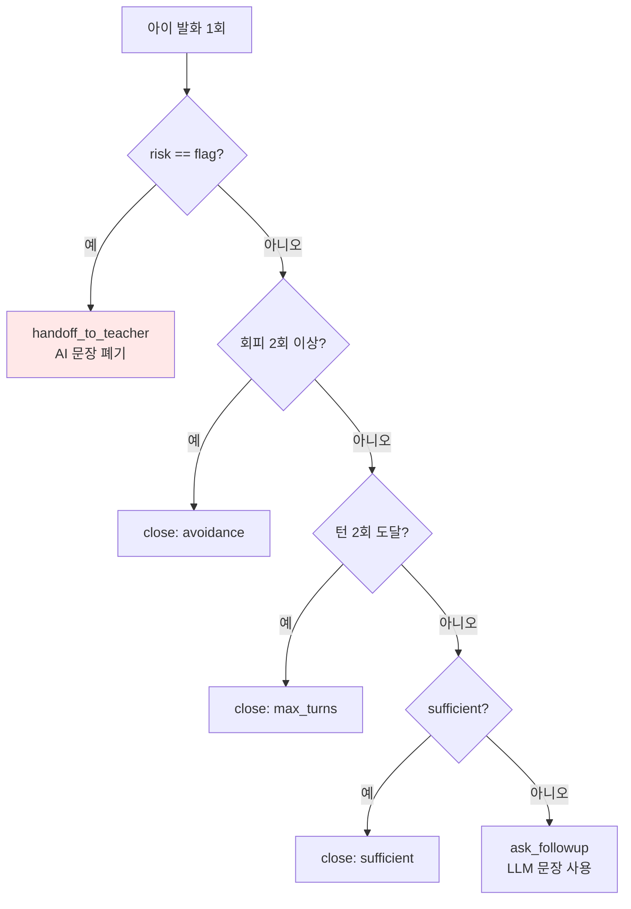

# 학생 화면 기술 인벤토리

담당: 이유민 · 2026-09-18 기준 · 대상: 학생 화면 1~3단계(홈 → 마음 색 → 대화)

이 문서는 **지금 코드에 있는 것만** 적는다. 계획은 "아직 없음"으로 표시한다.

---

## 1. 한눈에 보기



주황 = OpenAI 호출 · 파랑 = DB 쓰기

---

## 2. 단계별 저장 타이밍

### 1단계 — 홈

**아무것도 저장하지 않는다.**

의도적이다. 등교 홈의 선생님 편지는 "마지막 등교 세션 이후에 보낸 편지"만 띄우는 방식으로
읽음 처리를 대신한다. 여기서 세션을 만들면 자기 세션 때문에 편지가 뜨자마자 사라진다.
(`docs/planning/TEACHER_LETTER_LOGIC.md`)

### 2단계 — 마음 색 선택

색을 누르는 **즉시** 세션 행이 생긴다. 응답을 기다리지 않는다 — 첫 질문은 고정 문장이라
서버가 필요 없고, 기획안의 "색 3초" 예산이 네트워크에 묶이면 안 된다.

| 항목 | 값 |
|---|---|
| 호출 | `POST /api/checkins/session` |
| 저장 함수 | `startSignalCheckIn()` (`lib/supabase/raw/signalCheckIn.ts`) |
| 테이블 | `checkin_sessions` **INSERT** |

| 컬럼 | 값 |
|---|---|
| `enrollment_id` | `v_students_current` 에서 조회 |
| `session_date` | 오늘 (Asia/Seoul) |
| `period` | 등교 `morning` / 하교 `afternoon` |
| `attempt` | 직전 + 1 |
| `mood_color` | `green` / `yellow` / `red` / `navy` |
| `status` | `started` |

진행 중(`started`) 세션이 있으면 **새로 만들지 않고 이어 쓴다.** 대화 도중 새로고침해도
그 시간대를 잃지 않는다.

### 3단계 — 대화

#### 3-1. 녹음 (저장 없음)

`useVoiceRecorder` 가 `MediaRecorder` + `AnalyserNode` 로 100ms 마다 음량을 잰다.

| 상수 | 값 | 뜻 |
|---|---|---|
| `SILENCE_THRESHOLD` | 0.02 | 이 아래는 무음 |
| `SILENCE_MIN_MS` | 700 | 이만큼 이어져야 무음 1회 |
| `ASK_IF_DONE_MS` | 8,000 | 조용하면 안내 문구만 바꾼다 |
| `MAX_RECORDING_MS` | 60,000 | 자동 종료 |

⚠️ **오디오 Blob 은 훅과 전사 요청 안에서만 존재한다.** state·DB·Storage 어디에도 넣지 않는다.

#### 3-2. 전사 (저장 없음)

`POST /api/ai/transcribe` → `{ text }` 만 돌려준다. 오디오는 응답과 함께 사라진다.

#### 3-3. 한 턴 판단 (저장 없음)

`POST /api/ai/chat`. 아래 4장 참고.

#### 3-4. 종료 시 저장 — **순서가 중요하다**



**파생 수치가 먼저다.** 전문 저장이 세션을 `completed` 로 바꾸므로, 순서를 바꾸면
파생 수치가 들어갈 자리가 없다.

| 호출 | 테이블 · 컬럼 | 규칙 |
|---|---|---|
| `/api/checkins/prosody` | `checkin_sessions.prosody` (jsonb) | `status='started'` 일 때만 |
| `/api/checkins/transcript` | `.transcript` `.status` `.stop_reason` `.completed_at` | **쓰기 1회** |
| `/api/checkins/meeting-request` | `meeting_requests` INSERT | 종료 후에도 가능 |

`saveWholeTranscript()` 는 `status='started' AND transcript IS NULL` 일 때만 쓴다.
같은 내용 재시도는 통과, 다른 내용 두 번째는 409. DB 트리거 `checkin_transcript_guard` 가
저장된 전문의 삭제·수정을 막는다.

#### 저장되는 모양

```jsonc
// checkin_sessions.transcript
[
  { "speaker": "assistant", "content": "노랑이네. 오늘 학교는 어땠어?", "input_method": "fixed" },
  { "speaker": "student",   "content": "오늘도 그 친구랑 말 안 했어요.", "input_method": "voice" },
  { "speaker": "assistant", "content": "그랬구나. 지금은 좀 어때?",      "input_method": "text" }
]
```

`input_method` — `voice` 녹음 · `text` AI 또는 칩 · `fixed` 고정 첫 질문

```jsonc
// checkin_sessions.prosody
{
  "utterances": [
    { "index": 0, "duration_sec": 6.8, "response_delay_sec": 3.1,
      "silence_count": 2, "silence_total_sec": 3.1,
      "syllables_per_sec": 2.1, "loudness_raw": 0.31 }
  ],
  "baseline_days": 0    // 해석하는 쪽에서 채운다
}
```

---

## 3. 코드가 판단하는 것 (AI 아님)

기획안 §8.8 "지표는 코드로". LLM 을 부를 필요가 없고, 규칙이 명시적이라 교사에게 설명할 수 있다.

### 3-1. 첫 질문 — `lib/chat/openers.ts`

색 × 등하교 × **요일**로 정해지는 고정 문장 24개. AI 호출 0원.

```
pickOpener(flow, color) = POOL[flow][color][요일 % 3]
```

무작위가 아니라 요일인 이유: 새로고침할 때마다 바뀌면 아이가 혼란스럽다.

문장 규칙 — 줄표(—)를 쓰지 않는다(생성 티가 난다). "하나만" 같은 흥정하는 말을 쓰지 않는다.

### 3-2. 회피 판정 — `lib/chat/gates.ts`

```ts
looksAvoidant(text) =
  20자 이하 AND ["말하기 싫","얘기하기 싫","모르겠","몰라","그냥",
                 "없어","안 할래","안할래","패스"] 중 하나 포함
```

20자 제한이 있는 이유: 길게 설명하면서 "그냥"을 쓴 경우까지 회피로 잡으면 오탐이다.

### 3-3. 종료 게이트 — `decideNext()`

**순서가 곧 우선순위다.**



`MAX_TURNS = 2` · `MAX_AVOIDANCE = 2`

**아이에게 보여줄 문장은 게이트가 정한다.** LLM 문장은 `ask_followup` 일 때만 쓴다.
실측에서 모델이 2턴째에도 후속 질문을 만들었지만 게이트가 종료 인사로 덮어썼다.

턴 수와 회피 횟수는 **화면이 보낸 값을 쓰지 않고 서버가 전문에서 다시 센다.**

### 3-4. 가이드 힌트 — `lib/chat/hints.ts`

⚠️ 프롬프트로 "하지 마"를 늘리는 것보다 **허용 형태를 못박는 쪽이 훨씬 잘 듣는다.**
실측에서 금지 목록만 있을 때 1/3 위반 → 6갈래를 명시하니 0/8 이 됐다.

답변이 아니라 **주제**다. 완성된 답을 보여주면 아이가 그대로 읽고, 그러면 기록이
아이 말이 아니라 우리 문장이 된다.

| 턴 | 내용 |
|---|---|
| 1 | 색·등하교별 주제 3개 (예: 노랑 하교 → 수업 시간 / 쉬는 시간 / 급식 시간) |
| 2 | 그때 어떤 기분이었는지 / 지금은 어떤지 / 더 하고 싶은 말 |

음성을 쓸 수 없을 때(마이크 거부·세션 없음)만 누를 수 있는 선택지로 바뀐다.

---

## 4. AI 를 쓰는 곳

| # | 용도 | 모델 | 환경변수 | 위치 |
|---|---|---|---|---|
| 1 | 음성 → 텍스트 | `gpt-4o-mini-transcribe` | `STT_MODEL` | `/api/ai/transcribe` |
| 2 | 후속 질문 + 위험/충분 표시 | `gpt-4o-mini` | `CHAT_MODEL` | `/api/ai/chat` |

`AI_ENABLED=false` 면 둘 다 키를 읽기 전에 503 을 내고, 화면은 칩 흐름으로 되돌아간다.

### 4-1. STT

`language=ko` 고정. 파일 이름의 확장자로 포맷을 판단하므로 **Blob 의 mime 에서 확장자를 만든다**
(고정하면 사파리 `audio/mp4` 가 전부 실패한다).

모델 선택 근거 — 합성 한국어 아동 발화 9건 실측:

| | 회피 판정 일치 | 내용어 오류 | 가격 |
|---|---|---|---|
| `gpt-4o-mini-transcribe` | 6/6 | **0건** | $0.003/분 |
| `whisper-1` | 6/6 | 2건 (피구→피고) | $0.006/분 |

⚠️ 합성음이다. **실제 아동 음성으로는 미검증.**

### 4-2. 대화 — `lib/chat/prompt.ts`

**목적이 "좋은 질문을 하게 하는 것"이 아니라 "하면 안 되는 질문을 막는 것"이다.**

입력 / 출력:

```jsonc
// 입력
{ "flow": "checkout", "color": "yellow", "turn_count": 1,
  "recent_context": "2026-09-17(red): 오늘도 지호가 저랑 말 안 했어요.\n…",
  "transcript": [ … ] }

// 출력 (Structured Outputs, strict)
{ "reply": "…", "sufficient": false, "risk": "none" }
```

`max_output_tokens: 200` · `store: false`

프롬프트의 뼈대:

- **말투** — 초3~4 가 읽는 쉬운 반말, 두 문장 이내, 받아주고 나서 묻기
- **금지** — 캐묻기(누가·왜·언제), 감정 단정, 진단·평가·조언, 대신 약속하기,
  해결책·방법·다음 행동 묻기, 아이가 말하지 않은 사람·일 묻기
- **후속 질문 6갈래** — ① 더 말해달라 ② 그 다음 ③ 아이 말 되묻기 ④ 그때 기분
  ⑤ 지금 ⑥ 하루의 다른 때. 이 밖은 안 된다. ①②③ 을 먼저 고른다.
  금지 목록만으로는 모자랐다 — "조언 금지" 가 있는데도 "어떻게 하면 좋을까?" 가 나왔다.
  허용 형태를 못박고 나서야 잡혔다
- **risk = flag 조건** — 몸을 다침 / 자해 / 집·학교에서 지속적으로 힘든 일.
  flag 면 **AI 문장을 만들지 않는다.** 애매하면 flag.
- **sufficient 조건** — 최소한의 상황이 담겼거나, 더 말하고 싶지 않은 것이 분명할 때
- **recent_context 쓰는 법** — 이어지는 일이면 "오늘은 어떤지" 묻는다.
  "계속" "여전히" "아직도" 를 쓰지 않는다 — 나아지지 않았다는 뜻으로 들려서
  아이가 자기 일을 실패처럼 느끼게 된다. 과거를 근거로 따지지 않는다

`parseChatTurn()` 이 응답을 한 번 더 검증하고, **`risk === "flag"` 면 AI 문장을 버린다.**
거부(refusal)도 위험 신호로 다룬다.

### 4-3. 과거 맥락 — `lib/checkins/recentContext.ts`

**서버가 읽는다.** 클라이언트가 보낸 `recent_context` 는 무시한다 — 지난 세션 내용을
브라우저가 정할 수 있으면 안 된다.

최근 7일 · 최대 4세션 · 600자. 아이 발화만. **요약하지 않는다** (요약의 해석이 섞이고 호출이 하나 는다).

비용 실측: 입력 604 → 652 토큰. 세션당 $0.00001 미만.

---

## 5. 비용

세션당 약 **$0.0035**, 이 중 STT 가 86%.

| 상황 | 세션 | 비용 |
|---|---|---|
| 한 반 30명 × 2회 | 60 | $0.21 |
| 투표 3,000명 × 1회 | 3,000 | $10.5 |

---

## 6. 아직 없는 것

| 항목 | 상태 |
|---|---|
| **감정 추론 / 해석** | ❌ 재료(전문·prosody)는 쌓이지만 읽는 쪽이 없다. `analysis_runs` 비어 있음 |
| **기준선 계산** | ❌ `baseline_days` 가 항상 0. 본인 평균 대비가 없으면 숫자에 의미가 없다 |
| 세션당 녹음 횟수 상한 | ❌ 외부 공개 전까지 보류 |
| 학생 로그인 | ❌ 개발 중에는 시드 학생으로 우회 (`DEV_STUDENT_ID`, 프로덕션 차단) |
| 아이템 화면 연결 | ❌ `ItemReveal` 이 목업 이모지. `/api/ai/item-generation` 을 아무도 부르지 않는다 |
| TTS (AI 가 읽어주기) | ❌ |

### 알려진 이슈

- **따돌림·가정불화가 `risk=flag` 로 안 잡힌다.** "애들이 저만 빼고 단톡방 만들었어요",
  "엄마아빠가 어제 크게 싸웠어요" 를 실측에서 놓쳤다. flag 조건의 "지속적으로" 때문으로 보인다
- **"왜" 로 들리는 질문이 남는다.** 짧은 회피성 답("그냥 좀 별로였어요")에
  "별로였던 이유가 뭐였어?" 가 나온다. 6갈래 어디에도 없는 형태다.
  조언·타인 캐묻기·부정 어투는 8회 실측에서 0건이었지만 이건 남았다

---

## 7. 교사 화면에 넘기는 것

```
GET  /api/teacher/meeting-requests   → { items: MeetingRequestCard[] }
POST /api/teacher/meeting-requests   { id } → 확인 처리
```

```jsonc
{
  "studentName": "민준",
  "message": "민준이에게 상담 신청이 도착했어요",  // 조사까지 완성된 문장
  "href": "/students/…",
  "priority": "high",       // 위험 게이트에서 올라온 것. 먼저 정렬된다
  "sessionId": "…", "sessionDate": "2026-09-18", "moodColor": "red"
}
```

담당 학급 범위는 `class_teachers` 로 **서버에서** 건다. 쿼리 파라미터로 받지 않는다.
