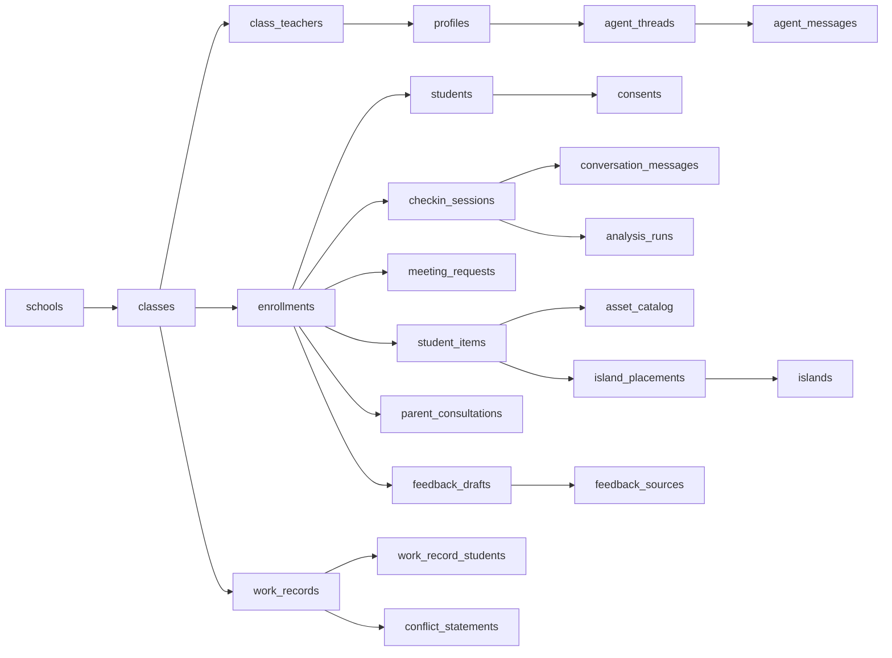

# 살핌 DB 스키마 v0.3

> 상태: `살핌_DB_스키마_v0.2.md`를 교차 검증해 수정한 개발 착수본
> 기준 스택: Next.js + TypeScript + Supabase(Postgres, Auth, Storage, Realtime)
> 작성일: 2026-09-13

## 0. v0.2에서 바뀐 것

뼈대는 v0.2 그대로다. v0.2가 v0.1과 Supabase안을 병합한 판단(재학 이력 분리, 대화 행 단위 저장, 섬 획득/배치 분리, 신호는 뷰로 계산)은 모두 유지한다.

검증 과정에서 **기능을 막는 항목 3개**와 **병합 중 누락된 항목 4개**를 발견해 고쳤다.

| # | 바뀐 것 | 왜 |
|---|---|---|
| 1 | `students.id`를 Auth와 분리 | Auth 직결이면 학생 행을 만들 때 Auth 사용자가 먼저 있어야 해서 **시드 데이터가 막힌다** |
| 2 | 체크인 잠금을 컬럼 단위로 | v0.2대로 테이블 전체를 잠그면 **세션을 완료 처리할 수 없다** |
| 3 | `student_items.is_core` + 슬롯 | "하루 핵심 1개"가 기획인데 v0.2에 구분할 컬럼이 없었다 |
| 4 | `asset_catalog.dedup_key` | 같은 아이템을 학생마다 생성한다. 3D 생성은 건당 과금 |
| 5 | `analysis_runs.category_tags` / `moderation_flag` 컬럼 승격 | 협진 챗봇 필터와 패턴 경고의 매 조회 경로. jsonb 안에 있으면 인덱스를 못 건다 |
| 6 | `checkin_sessions.attempt` | 위기 감지로 중단된 학생이 같은 날 재시도할 수 없었다 |
| 7 | `feedback_drafts.final_text` | AI 초안과 교사 수정본을 함께 남긴다. 교사가 검토했다는 증거 |

표기: *(v0.2)* 유지 / *(v0.3 수정)* / *(v0.3 신규)*

---

## 1. 설계 원칙

- 원본과 해석을 분리한다. 해석이 바뀌어도 원본을 덮어쓰지 않는다.
- 인덱스를 걸 값은 일반 컬럼, 보여주기만 하는 값은 `jsonb`.
- 테이블·컬럼명은 `snake_case`. 화면용 변환은 repository에서 한다.
- 삭제 대신 상태 변경(`status`, `ended_on`, `archived_at`).
- 모든 시각은 `timestamptz`. 날짜 조회용 `date` 컬럼은 별도로 둔다.
- 기록은 추가 전용이다. 정정은 새 레코드 + 이전 레코드 참조로 한다.
- **읽기는 브라우저에서 직접(RLS로 보호), 쓰기는 서버를 경유한다.** AI API 키가 브라우저에 있을 수 없고, 보호자 동의 확인·권한 확인·감사 로그를 한 곳에서 강제하려면 서버가 필요하다. 단 서버의 service_role 키는 RLS를 우회하므로, **실제 검증은 서버 코드의 책임**이고 RLS는 2차 차단이다.

---

## 2. 전체 관계도



---

## 3. 조직·사용자

### 3.1 `schools` *(v0.2)*

| 컬럼 | 타입 | 설명 |
|---|---|---|
| `id` | uuid | PK |
| `name` | text | 학교명 |
| `created_at` | timestamptz | |

### 3.2 `classes` *(v0.2)*

| 컬럼 | 타입 | 설명 |
|---|---|---|
| `id` | uuid | PK |
| `school_id` | uuid | FK → `schools.id` |
| `name` | text | 예: `3학년 2반` |
| `school_year` | integer | 예: `2026` |
| `grade` | integer | |
| `semester` | integer | |
| `created_at` | timestamptz | |

### 3.3 `profiles` (교사·관리자) *(v0.2)*

| 컬럼 | 타입 | 설명 |
|---|---|---|
| `id` | uuid | PK, `auth.users.id` 참조 |
| `role` | text | `teacher`, `admin` |
| `display_name` | text | |
| `created_at` | timestamptz | |

### 3.4 `class_teachers` *(v0.2)*

| 컬럼 | 타입 | 설명 |
|---|---|---|
| `class_id` | uuid | FK → `classes.id` |
| `teacher_id` | uuid | FK → `profiles.id` |
| `role` | text | `homeroom`, `assistant`, `counselor` |
| `created_at` | timestamptz | |

유니크: `(class_id, teacher_id)`

### 3.5 `students` *(v0.3 수정 — Auth 분리)*

> **v0.2와의 차이:** v0.2는 `students.id = auth.users.id`로 1:1 연결했다. 되돌린다. Auth 사용자가 없으면 학생 행을 만들 수 없어서 `seed.sql`이 막히고(데모 학생 25명을 넣으려면 팀원 각자가 Auth 사용자 25개를 먼저 만들어야 한다), "번호 로그인"의 구현 방식(합성 이메일/커스텀 토큰)이 미결인 채로 PK에 박힌다. 인증 수단이 바뀌면 전 테이블 FK 마이그레이션이 된다.

| 컬럼 | 타입 | 설명 |
|---|---|---|
| `id` | uuid | PK, 독립 생성 |
| `auth_user_id` | uuid | nullable, UNIQUE, FK → `auth.users.id` *(v0.3 신규)* |
| `login_code` | text | nullable, UNIQUE. 번호/코드 식별용 |
| `display_name` | text | |
| `status` | text | `active`, `inactive` |
| `created_at` | timestamptz | |

인증 방식이 정해지면 `auth_user_id`만 채우면 된다. 스키마는 그대로다.

### 3.6 `enrollments` *(v0.2)*

학생과 학급의 학기별 관계. 진급·자리 이동 후에도 과거 기록의 소속이 보존된다.

| 컬럼 | 타입 | 설명 |
|---|---|---|
| `id` | uuid | PK |
| `student_id` | uuid | FK → `students.id` |
| `class_id` | uuid | FK → `classes.id` |
| `seat_row` | integer | 자리배치도용 |
| `seat_col` | integer | 자리배치도용 |
| `started_on` | date | |
| `ended_on` | date | nullable |
| `created_at` | timestamptz | |

유니크: `(class_id, student_id, started_on)`

부분 유니크 인덱스 *(v0.3 신규)* — 한 학생이 동시에 두 반에 재학하지 않는다.

```sql
create unique index enrollments_one_active
  on enrollments(student_id) where ended_on is null;
```

### 3.7 `consents` *(v0.2)*

보호자 동의·학교 승인 기록. 추가 전용이며, 철회는 `guardian_withdrawn` 행을 추가해 표현한다.

| 컬럼 | 타입 | 설명 |
|---|---|---|
| `id` | uuid | PK |
| `student_id` | uuid | FK → `students.id` |
| `consent_type` | text | `guardian`, `school_approval`, `guardian_withdrawn` |
| `consented_at` | timestamptz | |
| `document_ref` | text | nullable, 동의서 파일 참조 |
| `recorded_by` | uuid | FK → `profiles.id` |
| `created_at` | timestamptz | |

동의 없는 체크인을 막는 것은 스키마가 아니라 서버 쓰기 경로의 책임이다. 그 게이트가 없으면 이 테이블은 장식이다.

---

## 4. 학생 체크인 & 대화

### 4.1 `checkin_sessions` *(v0.3 수정 — attempt 추가)*

등교·하교 한 번의 활동.

| 컬럼 | 타입 | 설명 |
|---|---|---|
| `id` | uuid | PK |
| `enrollment_id` | uuid | FK → `enrollments.id` |
| `session_date` | date | 한국 시각 기준 날짜 |
| `period` | text | `morning`, `afternoon` |
| `attempt` | smallint | 기본 1. 중단 후 재시도 시 증가 *(v0.3 신규)* |
| `mood_color` | text | `green`, `yellow`, `red`, `navy` |
| `status` | text | `started`, `completed`, `stopped` |
| `stop_reason` | text | nullable, 위기 감지로 중단된 경우 *(v0.3 신규)* |
| `started_at` | timestamptz | |
| `completed_at` | timestamptz | nullable |
| `created_at` | timestamptz | |

유니크: `(enrollment_id, session_date, period, attempt)`

> **v0.2와의 차이 ①:** `attempt`가 없으면 위기 신호로 `stopped` 처리된 세션 때문에 유니크 제약이 걸려 그 학생이 같은 날 다시 체크인할 수 없다.
>
> **v0.2와의 차이 ②:** v0.2 §10.3은 이 테이블에 "수정 불가" 트리거를 걸라고 적었는데, 그러면 `status`를 `completed`로 바꿀 수 없다. **세션을 완료할 수 없다.** 불변이어야 하는 건 `mood_color`뿐이다 → §10.

### 4.2 `conversation_messages` *(v0.2 + prev_hash)*

메시지는 세션의 JSON 배열이 아니라 한 행 단위로 저장한다. 근거 추적과 부분 실패 복구에 유리하다.

| 컬럼 | 타입 | 설명 |
|---|---|---|
| `id` | uuid | PK |
| `session_id` | uuid | FK → `checkin_sessions.id` |
| `sequence` | integer | 세션 내 순서 |
| `speaker` | text | `student`, `assistant`, `system` |
| `content` | text | 질문·답변·안내 문구 |
| `input_method` | text | `voice`, `text`, `fixed` |
| `prev_hash` | text | nullable, 앞 메시지의 해시 *(v0.3 신규)* |
| `content_hash` | text | nullable, 체인 해시 (§10) |
| `created_at` | timestamptz | |

유니크: `(session_id, sequence)`. 추가 전용(수정·삭제 불가).

**실시간 음성 구현 규칙:** 추가 전용이므로 부분 transcript를 같은 행에 UPDATE하며 쌓을 수 없다. **앱에서 버퍼링해 발화가 확정될 때 1회 insert한다.**

### 4.3 `meeting_requests` *(v0.2)*

| 컬럼 | 타입 | 설명 |
|---|---|---|
| `id` | uuid | PK |
| `enrollment_id` | uuid | FK → `enrollments.id` |
| `source_session_id` | uuid | nullable, FK → `checkin_sessions.id` |
| `requested_by` | text | `student`, `system` |
| `note` | text | nullable |
| `priority` | text | `normal`, `high` |
| `status` | text | `requested`, `acknowledged`, `resolved` |
| `requested_at` | timestamptz | |
| `acknowledged_at` | timestamptz | nullable |
| `resolved_at` | timestamptz | nullable |

`status` 변경은 감사 로그에 자동 기록된다(§10).

---

## 5. AI 분석

### 5.1 `analysis_runs` *(v0.3 수정 — 핫패스 컬럼 승격)*

분석 종류마다 테이블을 만들지 않고 공통 실행 테이블로 시작한다. 원본(`conversation_messages`)과 해석을 같은 테이블에 두지 않는다.

| 컬럼 | 타입 | 설명 |
|---|---|---|
| `id` | uuid | PK |
| `analysis_type` | text | `session_summary`, `risk_signal`, `vocabulary`, `relationship` 등 |
| `source_type` | text | `session`, `message`, `record`, `student`, `class` |
| `source_id` | uuid | 분석 대상 ID (폴리모픽, FK 없음) |
| `provider` | text | 초기 `mock` |
| `model` | text | nullable |
| `prompt_version` | text | |
| `schema_version` | integer | |
| `category_tags` | text[] | `학습`, `정서`, `가정환경` *(v0.3 신규)* |
| `moderation_flag` | boolean | 위기 신호 감지 여부 *(v0.3 신규)* |
| `needs_followup` | boolean | 면담 필요 판단 *(v0.3 신규)* |
| `result` | jsonb | 요약·키워드·감정어휘·근거 ID 등 나머지 전부 |
| `status` | text | `pending`, `completed`, `failed` |
| `error_message` | text | nullable |
| `created_at` | timestamptz | |

> **v0.2와의 차이:** v0.2는 `moderation_flag`·`category_tags`까지 전부 `result` jsonb에 넣었다. 그런데 이 둘은 **패턴 경고와 협진 챗봇이 매번 타는 조회 경로**다. jsonb 안에 있으면 Supabase안이 쓰던 부분 인덱스(`where moderation_flag = true`)와 배열 GIN 인덱스를 걸 수 없다. 기준: **인덱스를 걸 값은 컬럼, 보여주기만 하는 값은 `result`.**

`result` 예시:

```json
{
  "summary": "친구와의 축구 이야기를 즐겁게 말함",
  "keywords": ["축구", "친구", "골"],
  "emotionWords": ["재미있다", "신난다"],
  "evidenceMessageIds": ["message-uuid"]
}
```

**`source_id`는 폴리모픽이라 FK를 걸 수 없다.** 참조 무결성이 없고 cascade 삭제가 따라오지 않는다 — 고아 행이 생길 수 있음을 알고 쓴다. 분석 규격이 굳으면 타입별 테이블로 분리한다.

### 5.2 패턴 경고·관계지도는 테이블로 저장하지 않는다 *(v0.2)*

Supabase안의 `pattern_alerts`·`relationships` 실테이블을 채택하지 않는다. 최신 상태를 보장하려면 동기화 부담이 더 크다. `analysis_runs`를 집계하는 뷰로 계산한다.

```sql
create view v_signal_flags as
select e.id as enrollment_id, e.class_id,
       a.analysis_type, a.category_tags,
       a.moderation_flag, a.needs_followup, a.result, a.created_at
from analysis_runs a
join checkin_sessions cs on a.source_type = 'session' and a.source_id = cs.id
join enrollments e on e.id = cs.enrollment_id
where a.status = 'completed'
  and (a.moderation_flag or a.needs_followup or a.analysis_type = 'relationship');
```

느려지면 materialized view로 승격한다.

---

## 6. 섬과 아이템

획득(불변)과 배치(가변)를 분리한다. 위치를 옮겨도 획득 이력은 바뀌지 않는다.

### 6.1 `islands` *(v0.2)*

| 컬럼 | 타입 | 설명 |
|---|---|---|
| `id` | uuid | PK |
| `enrollment_id` | uuid | FK → `enrollments.id`, UNIQUE |
| `name` | text | |
| `theme` | text | |
| `created_at` | timestamptz | |

### 6.2 `asset_catalog` *(v0.3 수정 — dedup_key 추가)*

| 컬럼 | 타입 | 설명 |
|---|---|---|
| `id` | uuid | PK |
| `dedup_key` | text | 예: `soccer_ball` *(v0.3 신규)* |
| `style_version` | text | 아트 스타일 버전 *(v0.3 신규)* |
| `asset_type` | text | 아이템 분류 |
| `name` | text | 화면 표시 이름 |
| `model_url` | text | Storage의 GLB URL |
| `thumbnail_url` | text | nullable |
| `source` | text | `preset`, `generated` |
| `generation_metadata` | jsonb | nullable, 모델·프롬프트·작업 ID |
| `status` | text | `processing`, `ready`, `failed` |
| `created_at` | timestamptz | |

유니크: `(dedup_key, style_version)`

> **v0.2와의 차이:** Supabase안에 있던 `keyword UNIQUE`(키워드당 1개만 생성해 재사용)가 병합 중 사라졌다. 3D 생성은 건당 과금이므로 dedup 키가 없으면 같은 축구공을 학생마다 새로 만든다. 스타일을 바꿀 여지를 남기려고 `style_version`과 묶어 유니크를 건다.

### 6.3 `student_items` (획득, 불변) *(v0.3 수정 — 슬롯·핵심 구분)*

| 컬럼 | 타입 | 설명 |
|---|---|---|
| `id` | uuid | PK |
| `enrollment_id` | uuid | FK → `enrollments.id` |
| `asset_id` | uuid | FK → `asset_catalog.id` |
| `source_session_id` | uuid | nullable, FK → `checkin_sessions.id` |
| `source_message_id` | uuid | nullable, FK → `conversation_messages.id` |
| `earned_on` | date | 한국 시각 기준 획득 날짜 *(v0.3 신규)* |
| `slot` | smallint | `1` 또는 `2` — 하루 2개 제한용 *(v0.3 신규)* |
| `is_core` | boolean | 핵심 컴포넌트 여부 *(v0.3 신규)* |
| `earned_at` | timestamptz | |

```sql
create unique index student_items_daily_slot
  on student_items(enrollment_id, earned_on, slot);
create unique index student_items_daily_core
  on student_items(enrollment_id, earned_on) where is_core;
```

> **v0.2와의 차이:** v0.2에는 `is_core` 컬럼이 아예 없었다. 기획은 "하루 2개, 그중 핵심 1개"인데 구분할 수단이 없었다. 또 v0.2 §6.3은 "날짜별 개수 체크 제약"으로 보조한다고 적었지만, 하루 개수는 행 단위 조건이 아니어서 CHECK로 표현할 수 없다. 위의 **부분 유니크 인덱스**가 동시 요청에서도 이걸 보장한다.
>
> `earned_on`을 생성 컬럼으로 만들지 않은 이유: `at time zone` 변환이 STABLE이라 Postgres가 생성 컬럼에서 거부한다. 기본값으로 채운다.

### 6.4 `island_placements` (배치, 가변) *(v0.2)*

| 컬럼 | 타입 | 설명 |
|---|---|---|
| `id` | uuid | PK |
| `island_id` | uuid | FK → `islands.id` |
| `student_item_id` | uuid | FK → `student_items.id` |
| `position_x/y/z` | real | 위치 |
| `rotation_x/y/z` | real | 회전 |
| `scale_x/y/z` | real | 크기 |
| `updated_at` | timestamptz | |

유니크: `(island_id, student_item_id)`

렌더링 흐름:

```text
island_placements → student_items → asset_catalog
→ model_url + transform → React Three Fiber
```

---

## 7. 교사 업무기록과 상담

### 7.1 `work_records` *(v0.2)*

| 컬럼 | 타입 | 설명 |
|---|---|---|
| `id` | uuid | PK |
| `class_id` | uuid | FK → `classes.id` |
| `record_type` | text | `general`, `conflict`, `consultation`, `conference` |
| `title` | text | |
| `body` | text | |
| `body_tsv` | tsvector, generated | 검색용. 설정은 `simple` |
| `occurred_at` | timestamptz | |
| `created_by` | uuid | FK → `profiles.id` |
| `status` | text | `draft`, `sealed` |
| `sealed_at` | timestamptz | nullable |
| `supersedes_id` | uuid | nullable, FK → `work_records.id` |
| `created_at` | timestamptz | |

`sealed` 이후 수정은 트리거가 막는다. 정정은 새 행을 만들고 `supersedes_id`로 이전 기록을 가리킨다(이전 기록은 그대로 남는다).

`body_tsv`에 `simple` 설정을 쓰는 이유: Postgres 기본 사전에 한국어가 없다. 공백 단위 색인이며 프로토타입 검색에는 충분하다. 정확도가 문제되면 trigram 또는 `pg_bigm`을 검토한다.

### 7.2 `work_record_students` *(v0.2)*

| 컬럼 | 타입 | 설명 |
|---|---|---|
| `work_record_id` | uuid | FK → `work_records.id` |
| `enrollment_id` | uuid | FK → `enrollments.id` |
| `participant_role` | text | nullable, `participant`, `witness` |

유니크: `(work_record_id, enrollment_id)`

### 7.3 `conflict_statements` *(v0.2)*

| 컬럼 | 타입 | 설명 |
|---|---|---|
| `id` | uuid | PK |
| `work_record_id` | uuid | FK → `work_records.id` |
| `enrollment_id` | uuid | nullable |
| `speaker_label` | text | 이름 또는 익명 표시 |
| `content` | text | 진술 원문 |
| `created_at` | timestamptz | |

부모 기록이 `sealed`면 진술도 변경할 수 없다 *(v0.3 신규 — v0.2는 부모만 잠가서 자녀 행은 계속 고칠 수 있었다)*.

### 7.4 `parent_consultations` *(v0.2)*

| 컬럼 | 타입 | 설명 |
|---|---|---|
| `id` | uuid | PK |
| `enrollment_id` | uuid | FK → `enrollments.id` |
| `teacher_id` | uuid | FK → `profiles.id` |
| `work_record_id` | uuid | nullable |
| `scheduled_at` | timestamptz | nullable |
| `status` | text | `preparing`, `in_progress`, `completed` |
| `notes` | text | 상담 메모 |
| `evidence_refs` | jsonb | 근거자료 참조 배열 |
| `updated_at` | timestamptz | |
| `created_at` | timestamptz | |

`@학생이름` 멘션은 프론트에서 파싱해 `enrollment_id`로 바꾸고, §9.3의 컨텍스트 조회 함수 결과를 `evidence_refs`에 담는다.

---

## 8. 교사 피드백

### 8.1 `feedback_drafts` *(v0.3 수정 — final_text 추가)*

| 컬럼 | 타입 | 설명 |
|---|---|---|
| `id` | uuid | PK |
| `enrollment_id` | uuid | FK → `enrollments.id` |
| `draft_text` | text | AI 초안. 불변 |
| `final_text` | text | nullable, 교사가 고친 실제 발송문 *(v0.3 신규)* |
| `status` | text | `pending`, `dismissed`, `sent` |
| `created_by` | text | `ai`, `teacher` |
| `created_at` | timestamptz | |
| `sent_at` | timestamptz | nullable |

> **v0.2와의 차이:** v0.2는 컬럼을 늘리지 않으려고 `draft_text`를 교사가 덮어쓰고 발송 시 잠그는 방식을 택했다. 그러면 AI가 무엇을 제안했고 교사가 무엇을 고쳤는지가 사라진다. 그 차이가 **사람이 검토했다는 기록**이므로 분리해 남긴다.

### 8.2 `feedback_sources` *(v0.2)*

| 컬럼 | 타입 | 설명 |
|---|---|---|
| `feedback_id` | uuid | FK → `feedback_drafts.id` |
| `session_id` | uuid | FK → `checkin_sessions.id` |

학생 피드백함은 `status = 'sent'`인 것만 조회한다.

---

## 9. 선생님 Agent

### 9.1 `agent_threads` *(v0.2)*

| 컬럼 | 타입 | 설명 |
|---|---|---|
| `id` | uuid | PK |
| `teacher_id` | uuid | FK → `profiles.id` |
| `class_id` | uuid | FK → `classes.id` |
| `enrollment_id` | uuid | nullable |
| `thread_type` | text | `collab_meeting`(협진회의), `counseling_prep`(상담준비) |
| `title` | text | nullable |
| `created_at` | timestamptz | |

### 9.2 `agent_messages` *(v0.2)*

| 컬럼 | 타입 | 설명 |
|---|---|---|
| `id` | uuid | PK |
| `thread_id` | uuid | FK → `agent_threads.id` |
| `role` | text | `teacher`, `assistant` |
| `domain` | text | nullable, `learning`, `emotion`, `home` |
| `content` | text | |
| `evidence` | jsonb | 근거 레코드 ID 목록 |
| `created_at` | timestamptz | |

원문을 복사하지 않고 근거 ID를 저장한다. 화면에서 ID로 실제 근거를 다시 보여준다.

### 9.3 학생 컨텍스트 조회 함수 *(v0.2)*

```sql
create or replace function get_student_context(
  p_enrollment_id uuid,
  p_since timestamptz default (now() - interval '14 days')
)
returns jsonb language sql stable as $$
  select jsonb_build_object(
    'student', (select row_to_json(v) from v_students_current v
                where v.enrollment_id = p_enrollment_id),
    'recent_sessions', (
      select coalesce(jsonb_agg(s order by s.created_at desc), '[]'::jsonb)
      from checkin_sessions s
      where s.enrollment_id = p_enrollment_id and s.created_at >= p_since),
    'recent_analysis', (
      select coalesce(jsonb_agg(jsonb_build_object(
        'analysis_type', a.analysis_type, 'category_tags', a.category_tags,
        'needs_followup', a.needs_followup, 'result', a.result,
        'created_at', a.created_at) order by a.created_at desc), '[]'::jsonb)
      from v_signal_flags a
      where a.enrollment_id = p_enrollment_id and a.created_at >= p_since),
    'work_records', (
      select coalesce(jsonb_agg(w order by w.occurred_at desc), '[]'::jsonb)
      from work_records w
      join work_record_students wrs on wrs.work_record_id = w.id
      where wrs.enrollment_id = p_enrollment_id and w.created_at >= p_since),
    'open_meeting_requests', (
      select coalesce(jsonb_agg(m), '[]'::jsonb)
      from meeting_requests m
      where m.enrollment_id = p_enrollment_id and m.status <> 'resolved')
  );
$$;
```

서버가 `supabase.rpc('get_student_context', { p_enrollment_id })` 한 번으로 프롬프트용 컨텍스트를 받는다. 한 학급 분량이면 SQL 조회가 벡터DB보다 정확하고 싸다.

### 9.4 `v_students_current` *(v0.3 신규)*

`enrollment_id` 축은 설계적으로 옳지만 화면은 "학생"을 고른다. 프론트가 가장 많이 틀릴 지점이므로 변환용 뷰를 둔다.

```sql
create view v_students_current as
select s.id as student_id, e.id as enrollment_id, e.class_id,
       s.display_name, e.seat_row, e.seat_col, s.status
from students s
join enrollments e on e.student_id = s.id and e.ended_on is null;
```

**UI와 URL은 `student_id`를 쓰고, `enrollment_id` 변환은 repository에서 한다.** 화면 컴포넌트가 `enrollment_id`를 prop으로 받으면 설계가 샌 것이다.

---

## 10. 무결성 장치

기획 §9 "기록의 무결성"을 DB 레벨로 보장한다. **단 트리거는 기능이 다 동작한 뒤 마지막 마이그레이션에서 적용한다** — 1일차에 넣으면 팀원들의 시드 데이터와 로컬 실험이 예외로 죽어서 개발이 느려진다.

| 대상 | 장치 |
|---|---|
| `conversation_messages`, `student_items`, `consents` | UPDATE·DELETE 전면 금지 |
| `checkin_sessions` | `mood_color` 변경 금지 + 종료 상태 되돌리기 금지. **그 외 UPDATE는 허용** |
| `work_records` | `sealed` 이후 수정 금지. 정정은 `supersedes_id`로 새 행 |
| `conflict_statements` | 부모 기록이 `sealed`면 변경 금지 |
| `feedback_drafts` | `sent` 이후 수정 금지 |
| `meeting_requests`, `work_records`, `parent_consultations` | 변경 시 `audit_log`에 before/after 자동 기록 |
| `conversation_messages` | insert 시 해시 체인 자동 계산 |

### 10.1 체크인 가드 *(v0.3 수정)*

v0.2는 테이블 전체를 잠그려 했고, 그러면 `status`를 `completed`로 바꿀 수 없다.

```sql
create or replace function checkin_guard() returns trigger
language plpgsql as $$
begin
  if NEW.mood_color is distinct from OLD.mood_color then
    raise exception 'mood_color는 수정할 수 없습니다';
  end if;
  if OLD.status in ('completed','stopped')
     and NEW.status is distinct from OLD.status then
    raise exception '종료된 세션의 상태는 되돌릴 수 없습니다';
  end if;
  return NEW;
end; $$;
```

### 10.2 해시는 체인이어야 한다 *(v0.3 수정)*

v0.2는 `sha256(content)`였다. 쓰기 권한이 있으면 해시도 같이 다시 계산되므로 아무것도 증명하지 못한다. 앞 메시지의 해시를 물려야 중간 한 줄만 바꿔치기하는 것이 불가능해진다.

```sql
create or replace function set_content_hash() returns trigger
language plpgsql as $$
declare p text;
begin
  select content_hash into p from conversation_messages
   where session_id = NEW.session_id order by sequence desc limit 1;
  NEW.prev_hash := p;
  NEW.content_hash := encode(
    sha256(convert_to(coalesce(p,'') || NEW.content, 'utf8')), 'hex');
  return NEW;
end; $$;
```

`pgcrypto`의 `digest`가 아니라 Postgres 내장 `sha256()`을 쓴다 — Supabase에서 `pgcrypto`는 `extensions` 스키마에 있어 한정자가 필요하다.

### 10.3 `audit_log` *(v0.3 수정)*

| 컬럼 | 타입 | 설명 |
|---|---|---|
| `id` | uuid | PK |
| `table_name` | text | |
| `row_id` | uuid | |
| `before` | jsonb | 변경 전 행 전체 |
| `after` | jsonb | 변경 후 행 전체 |
| `changed_by` | uuid | 행위자 |
| `changed_at` | timestamptz | |

> **v0.2와의 차이 ①:** v0.2는 컬럼 단위(`column_name`/`old_value`/`new_value`)였다. 행 단위 `before`/`after` jsonb면 트리거 하나를 모든 테이블에 붙일 수 있다.
>
> **v0.2와의 차이 ②:** v0.2는 `changed_by`에 `auth.uid()`를 넣었다. **쓰기가 서버(service_role)를 경유하면 이 값은 NULL이다.** 서버가 요청마다 `set_config('app.actor_id', ...)`를 심고, 트리거는 그걸 먼저 본다.

```sql
create or replace function current_actor() returns uuid
language sql stable as $$
  select coalesce(nullif(current_setting('app.actor_id', true), '')::uuid, auth.uid());
$$;
```

### 10.4 `view_log` *(v0.2)*

| 컬럼 | 타입 | 설명 |
|---|---|---|
| `id` | uuid | PK |
| `viewer_id` | uuid | FK → `profiles.id` |
| `entity_type` | text | `checkin_session`, `work_record`, `student_detail` 등 |
| `entity_id` | uuid | |
| `viewed_at` | timestamptz | |

"내용을 언제 확인했다"의 근거. 상세 화면을 열 때 서버가 1행 기록한다. **목록 조회마다 쓰지 않는다** — 학생 25명 목록에서 25행이 쌓이면 의미도 없고 비용만 든다.

---

## 11. RLS 방향

쓰기는 서버를 경유하므로 클라이언트 역할에서 쓰기 권한을 회수하고, RLS는 읽기 범위를 정의한다.

```sql
revoke insert, update, delete on all tables in schema public from anon, authenticated;

-- 교사는 자기 반(협진 포함)만
create policy "teachers read own class sessions"
on checkin_sessions for select to authenticated
using (exists (
  select 1 from enrollments e
  join class_teachers ct on ct.class_id = e.class_id
  where e.id = checkin_sessions.enrollment_id and ct.teacher_id = auth.uid()
));

-- 학생은 자기 데이터만 (auth_user_id 경유)
create policy "students read own sessions"
on checkin_sessions for select to authenticated
using (exists (
  select 1 from enrollments e
  join students s on s.id = e.student_id
  where e.id = checkin_sessions.enrollment_id and s.auth_user_id = auth.uid()
));
```

- `enrollment_id`로 연결된 테이블은 모두 위와 같은 패턴으로 복제한다 — `conversation_messages`(세션 경유), `meeting_requests`, `student_items`, `work_record_students`, `parent_consultations`, `feedback_drafts`.
- `parent_consultations`와 학부모 연락처처럼 민감한 데이터는 `class_teachers.role = 'homeroom'`으로 더 좁히는 것을 검토한다.
- 학생 화면에서 다른 학생의 색·발화·관계 분석과 교사 기록은 어떤 경로로도 읽히지 않아야 한다.
- **service_role은 RLS를 우회한다.** 따라서 RLS는 브라우저 직접 접근에 대한 2차 차단이고, 실제 검증은 서버 코드의 책임이다.
- AI API 키는 브라우저에 두지 않는다.
- Storage는 3D 에셋 버킷과 민감 데이터 버킷을 분리한다.

---

## 12. 인덱스 체크리스트

```text
checkin_sessions(enrollment_id, session_date desc)
checkin_sessions(session_date, period, status)
conversation_messages(session_id, sequence)
meeting_requests(enrollment_id, status)
meeting_requests(status, requested_at desc)
student_items(enrollment_id, earned_at desc)
island_placements(island_id)
work_records(class_id, occurred_at desc)
work_records USING gin(body_tsv)
work_record_students(enrollment_id, work_record_id)
parent_consultations(enrollment_id, created_at desc)
analysis_runs(source_type, source_id, analysis_type, created_at desc)
analysis_runs USING gin(category_tags)                  -- 협진 챗봇 필터 (v0.3)
analysis_runs(created_at desc) WHERE moderation_flag    -- 패턴 경고 (v0.3)
agent_messages(thread_id, created_at)
view_log(entity_type, entity_id, viewed_at desc)
audit_log(table_name, row_id, changed_at desc)
```

마지막 두 GIN·부분 인덱스가 §5.1의 컬럼 승격으로 가능해진 것이다.

---

## 13. 담당자별 작업 경계

| 담당자 | 기능 | 주 테이블 |
|---|---|---|
| 이유민 | 학생 대화(상담, 섬 제외) | `checkin_sessions`, `conversation_messages`, `meeting_requests`, `feedback_drafts` |
| 강윤지 | 섬·아이템 배치 | `islands`, `asset_catalog`, `student_items`, `island_placements` |
| 진승혜 | 선생님 대시보드 | 읽기 전용 — `v_students_current`, `v_signal_flags`, 집계 쿼리 |
| 이지현 | 선생님 Agent | `analysis_runs`, `agent_threads`, `agent_messages`, `get_student_context` |
| 김현우 | 학생 상세·업무기록·학부모 상담 | `work_records`, `work_record_students`, `conflict_statements`, `parent_consultations` |

`schools`, `classes`, `class_teachers`, `profiles`, `students`, `enrollments`, `consents`, `view_log`, `audit_log`는 공통 기반이다. 기능별 작업 전에 초기 세팅 PR 하나로 먼저 합친다.

- 담당자는 자기 기능의 repository와 UI를 함께 구현한다.
- 다른 담당자의 원본 테이블에 쓰지 않는다.
- 대시보드 담당자는 어떤 원본도 쓰지 않는다.
- Agent 담당자는 원본을 덮어쓰지 않고 `analysis_runs`에 행을 추가한다.
- 섬 담당자는 체크인 완료 후 전달받은 `session_id`/`message_id`를 보상 근거로 쓴다.
- **스키마를 바꾸면 반드시 PR로 공유한다.** 영향받는 화면과 담당자를 PR 본문에 적는다.

### 13.1 마이그레이션 순서

```text
1000_core          조직·사용자·학생·재학·동의   ← 공통 PR, 제일 먼저
1010_checkin       체크인·대화·면담신청
1020_island        섬·에셋·획득·배치
1030_work_records  업무기록·갈등·학부모상담·피드백
1040_agent         분석결과·Agent
1050_views         뷰·RPC
9000_integrity     트리거·감사로그·열람로그   ← 기능 완성 후
9010_rls           RLS·권한                  ← 마지막
```

공유된 마이그레이션 파일은 수정하지 않고 새 파일을 추가한다. 적용 후 `npx supabase gen types typescript --local > src/lib/supabase/database.types.ts`를 재생성해 커밋한다. 개발·데모 DB에는 가상 학생 데이터만 넣는다.

---

## 14. 미결 항목

스키마를 바꾸지 않고도 진행할 수 있게 분리해둔 것들이다.

| 항목 | 결정 방법 |
|---|---|
| 학생 인증 수단 (합성 이메일 / 커스텀 토큰 / 기기 식별) | `students.auth_user_id`만 채우면 되므로 나중에 결정 가능 |
| 원본 음성 저장 여부·보존 기간 | 개인정보 정책 확정 후. 현재 음성 파일 컬럼은 없다 |
| `analysis_runs.result` JSON Schema | 프롬프트 2~3회 돌려보고 굳힌다 |
| 퍼즐 섬 학기 집계·옆마을 이벤트 | `enrollments` → `classes.semester`로 유도 가능. 별도 테이블 불필요 |
| 3D 생성 실패 재시도 | `asset_catalog.status = 'failed'` 행 재처리 |
| 학부모 계정·학부모용 화면·연락처 | 필요해지면 `guardians` + `student_guardians` 추가 |
| 한국어 전문검색 정확도 | `simple`로 시작, 불만 나오면 trigram/`pg_bigm` |
| 패턴 경고·관계지도 계산 기준 | 뷰 정의만 바꾸면 되므로 스키마 영향 없음 |

### v0.2에서 해결된 것

체크인·대화 구조(행 단위), 섬 보상 구조(획득/배치 분리), 신호 저장 여부(뷰), 봉인 기록의 정정(`supersedes_id`), 기록 무결성의 DB 레벨 강제.

### v0.3에서 해결된 것

학생 인증이 PK를 잠그던 문제, 체크인을 완료할 수 없던 트리거, "하루 2개·핵심 1개"를 보장할 수단, 3D 에셋 중복 생성, 협진 챗봇·패턴 경고의 조회 경로, 아무도 쓰기를 못 하던 RLS, 하드닝이 개발을 막던 순서.
